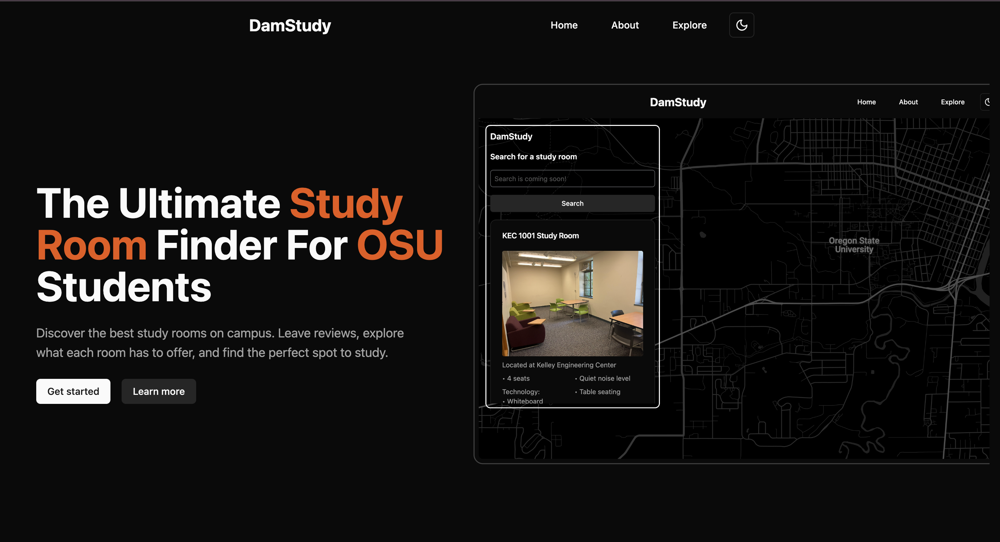

[](https://damstudy.netlify.app/)

# DamStudy (frontend)

The frontend of the DamStudy project, a platform for students to find and locate study spots in their area. This project is being developed by the [Google Developer Student Club - Oregon State University](https://gdsc.community.dev/oregon-state-university-corvallis-united-states/).

## Contributors

<a href="https://github.com/GDSC-OregonState/DamStudy-Frontend/graphs/contributors">
  
</a>

## Built With

- [Vite](https://vitejs.dev/)
- [React](https://reactjs.org/)
- [Tailwind CSS](https://tailwindcss.com/)
- [Shadcn](https://ui.shadcn.com/)
- [Google Maps API](https://developers.google.com/maps)
- [React Query](https://react-query.tanstack.com/)
- [TypeScript](https://www.typescriptlang.org/)
- [ESLint](https://eslint.org/)
- [Prettier](https://prettier.io/)
- [contrib.rocks](https://contrib.rocks)

## Getting Started

To get a local copy up and running follow these simple steps.

1. Clone the repo
   ```sh
   git clone <repo_url>
   ```
2. Install NPM packages
   ```sh
    npm install
   ```
3. Create a `.env.local` file in the root directory and add the following environment variable
   ```sh
    GOOGLE_MAPS_API_KEY=
   ```
4. Start the development server
   ```sh
    npm dev
   ```
5. Open your browser and go to `http://localhost:5173`

## Contributing

Contributions to this project are welcome. For keys, help, and other specific information, please refer to our [Discord Community](https://discord.gg/pYv3P9ZCbf).

## License

Distributed under the MIT License. See `LICENSE` for more information.
